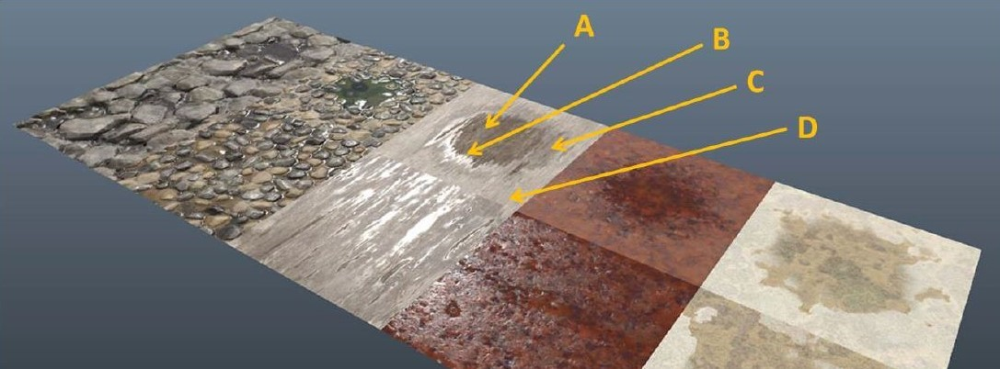

# Unreal&reg; Engine Plugin: Wetness Material Library &ndash; Readme

* Author: Copyright 2023 Roland Bruggmann aka brugr9. All Rights Reserved.
* Profile on UE Marketplace: [https://www.unrealengine.com/marketplace/profile/brugr9](https://www.unrealengine.com/marketplace/profile/brugr9)
* Profile on Epic Developer Community: [https://dev.epicgames.com/community/profile/PQBq/brugr9](https://dev.epicgames.com/community/profile/PQBq/brugr9)

---


*Fig.: Screenshot of Unreal&reg; Engine Plugin "Wetness Material Library" in UE Editor*

## Description

### 1. Features

* Darkening Albedo Master Material (cp. [Brinck, 58ff])
* Refraction based Material Instances (cp. [UEDoc, Using Refraction]): Air, Diamond, Glass, Ice, Plexiglas, Water

### 2. Branches

* main: README
* UE_4.26: Plugin

### 3. Elaboration

The visibility of water depends on the wetting of an overflowed material. A material&mdash;if not entirely hydrophobic&mdash;changes its properties if being overflowed by water. As described by [Brinck, 59ff] using the example of a puddle, typically there are four characteristic rendering regions that wet surfaces are mixed of (see figure 3.1.):

* (A) Core of the puddle, the water surface is totally flat.
* (B) Region where surface tension causes water to cling to the surface underneath, causing a shrink-wrapped look.
* (C) Region where water has saturated the surface, causing a darkening of the albedo, but not significantly affecting normals or specular response.
* (D) Dry, unmodified surface.


*Figure 3.1.: Brinck &ndash; Wetness*

## Appendix

### A. References

* [Brinck] Andrew Brinck Waylon; Maximov. Technical Art of Uncharted 4 – SIGGRAPH 2016. 6th Aug. 2016. Online: [http://advances.realtimerendering.com/other/2016/naughty_dog/index.html](http://advances.realtimerendering.com/other/2016/naughty_dog/index.html), PDF: [http://advances.realtimerendering.com/other/2016/naughty_dog/NaughtyDog_TechArt_Final.pdf](http://advances.realtimerendering.com/other/2016/naughty_dog/NaughtyDog_TechArt_Final.pdf) (visited on 23/02/2023).
* [UEDoc, Using Refraction] Epic Games: **Using Refraction**. In: Unreal Engine Documentation. URL: [https://docs.unrealengine.com/5.1/en-US/using-refraction-in-unreal-engine/](https://docs.unrealengine.com/5.1/en-US/using-refraction-in-unreal-engine/)
* [Cloward] Ben Cloward **Iridescent Bubble Shader - Advanced Materials - Episode 18**. In: Youtube. URL: [https://www.youtube.com/watch?v=bN84YxaBEGw](https://www.youtube.com/watch?v=bN84YxaBEGw)

### B. Citation

To acknowledge this work, please cite

> Bruggmann, R. (2023): Unreal&reg; Engine Plugin "Wetness Material Library" [Computer software], Version v4.26. Licensed under Creative Commons Attribution-ShareAlike 4.0 International. Online: https://github.com/brugr9/Wetness

```bibtex
@software{Bruggmann_Wetness_2023,
  author = {Bruggmann, Roland},
  year = {2023},
  version = {v4.26},
  title = {{Unreal Engine Plugin 'Wetness Material Library'}},
  url = {https://github.com/brugr9/Wetness}
}
```

---
<!-- Footer -->

[](https://creativecommons.org/licenses/by-sa/4.0/)

*Unreal&reg; Engine Plugin "Wetness Material Library"* &copy; 2023 by [Roland Bruggmann](https://dev.epicgames.com/community/profile/PQBq/brugr9) is licensed under [Creative Commons Attribution-ShareAlike 4.0 International](http://creativecommons.org/licenses/by-sa/4.0/)
